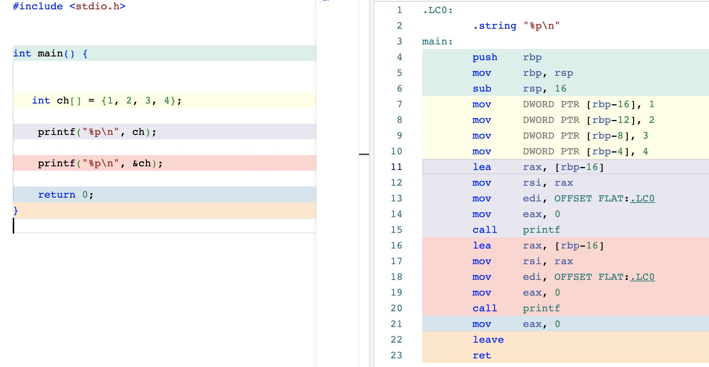
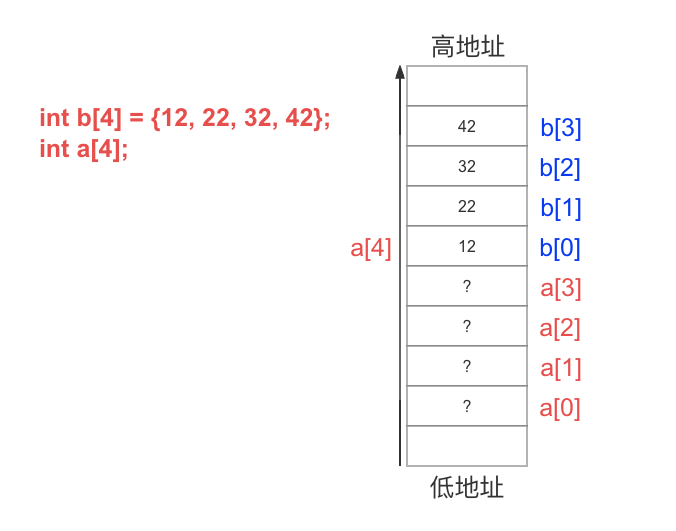
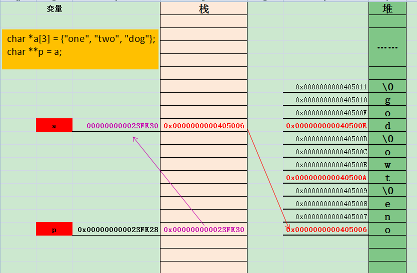
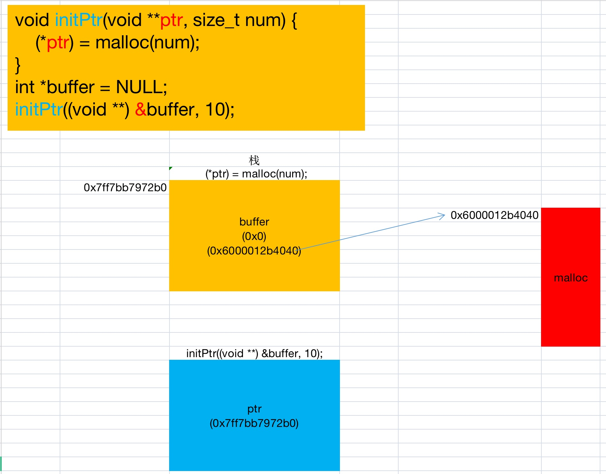
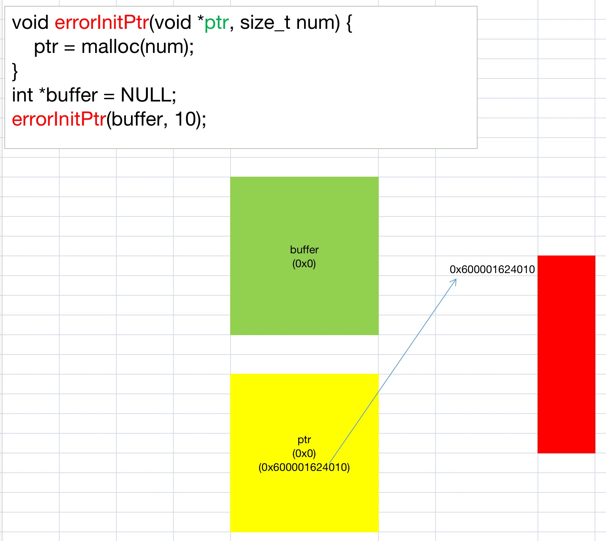
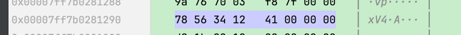
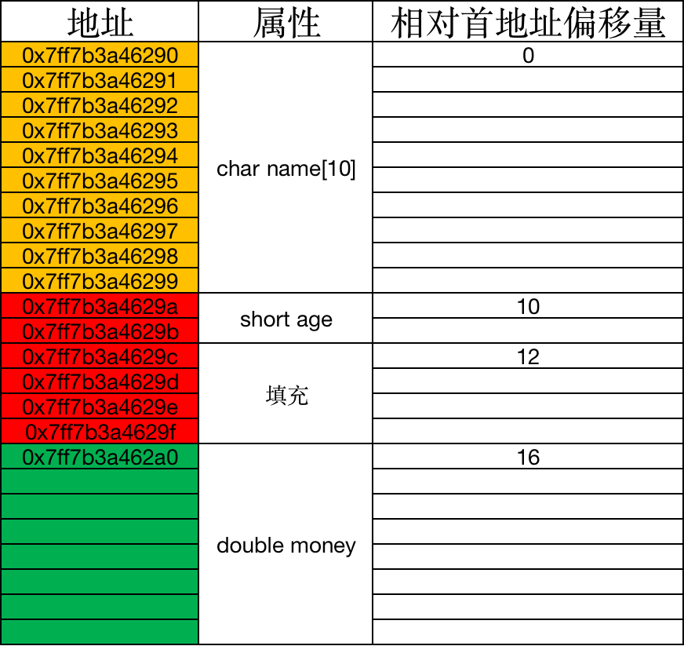
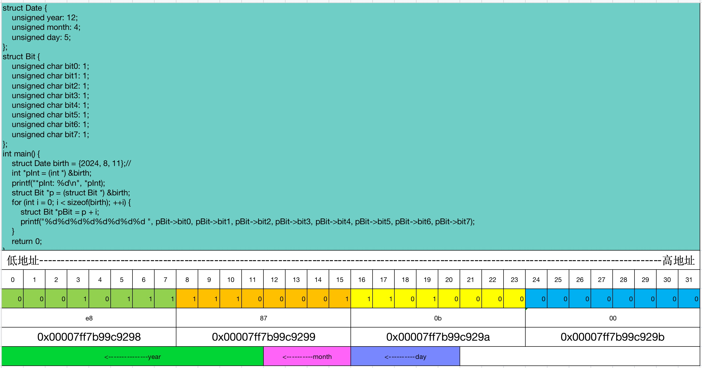

# 学习C语言

+ C程序的基本组成结构
  + 源文件
    + 后缀为.c
    + 实现程序功能
  + 头文件
    + 后缀为.h
    + 使用方式
      ```
      #include "main.h"
      ```
    + 函数声明｜全局变量的声明｜宏定义｜类型的声明
  + 一个C语言所组成的项目中只允许有一个main函数

### include<>和" "区别
> 编译器在编译的时候，如果为" ",编译器会先检查本工程目录下" "内对应的文件，
> 如果该文件不存在，继续检索，系统的头文件目录（标准C安装的目录），如果是<>，编译器
> 只会去系统头文件目录下检索

### 整形常量
```shell
10          代表int类型
10L         代表long类型
10LL        代表long long类型
10U         代表unsigned int类型
10UL        代表unsigned long类型
10ULL       代表unsigned long long类型
```

### 整形数据的打印格式
```
======d结尾
%hd     输出short类型
%d      输出int类型
%ld     输出long类型
%lld    输出long long类型
======u结尾
%hu     输出unsigned short类型
%u      输出unsigned int类型
%lu     输出unsigned long类型
%llu    输出unsigned long long类型
```


### 带宽
> 单位是Mb，注意是小写b，兆比特。转换为MB需要除以8


+ 预编译/预处理
  ```shell
  # -E            Only run the preprocessor
  # -o <file>      Write output to <file>
  gcc -E main.c -o main.i
  ```
  
+ 编译
  > gcc -o main main.c

  > gcc main.c -o main -DDEBUG #传参


## 指定入口函数
```
gcc -nostartfiles -efunc main.c
gcc -nostartfiles -e main program.c -o my_program

```

### 算数运算符
+ %取模运算符的两个操作数只能为整数


### 逻辑运算符
+ 逻辑真（关系成立）：非0
+ 逻辑假（关系不成立）：0


### 二维数组
> 在内存中并不存在二维数组，二维数组实际的硬件存储是连续编址的，也就是说内存中只有一维数组
> ，即放完一行之后顺次放入第二行，和一维数组存放方式是一样的


### 函数参数
+ 函数调用时，将实参的值赋值给形参
+ 形参只有在函数被调用时才会被分配内存空间（函数栈上分配）
+ 实参可以是常量、变量、表达式、函数名


### 局部变量
+ 定义在{}内的变量，称之为局部变量


### 全局变量
+ 全局变量如果没有被初始化，会被默认初始化为0

### 预处理
+ #号开头的命令称为**预处理命令**
+ 宏定义、文件包含、条件编译等

### 宏定义
+ 注意用括号
  ```
  #define max(a, b) (a)>(b)?(a):(b)
  #define F(x) (x)*(x)*(x)
  ```
+ 无参宏定义
  > #define PI 3.14


### 条件编译
```
#if         如果条件为真，则执行相应操作
#elif       
#else
#endif      结束相应的条件编译指令
#ifdef      如果该宏已定义，则执行相应操作
#ifndef     如果该宏没有定义，则执行相应操作
```

### 指针
+ 空指针的作用是防止指针变量变成野指针。
+ 指针变量+n，指针往后偏移了n个数据（不是字节）

+ 野指针
  > 未被初始化的指针

+ 空指针
  > 被赋值为NULL的指针，它不指向任何的对象或者函数  
  > 空指针不能直接使用，赋值空指针目的是判断，然后再操作

+ 万能指针
  + void *
  + 可以指向任何地址
    ```c
    int apge = 37;
    void *p = &age;
    ```
  + 可以隐式自动转化为其它类型指针
    ```c
    int *pi = p;
    ```
  + 不能对void *取值操作，因为它没有类型，或者说不能判断存储的是什么类型
    ```c
    printf("%d\n", *p); //error
    printf("%d\n", *(int *)p);//right
    ```


### typedef
+ typedef 类型 别名
  + typedef int INT; //INT 就是我们定义的新类型，代替int
  + typedef void (*PFUNA)(int a);//PFUNA就是我们定义的新类型

- typedef的一个重要用途是定义机器无关的类型
  - typedef long double Real;
  - typedef double Real;
  - typedef float Real;

- typedef 为现有类型创建别名
  - typedef unsigned int UInt32;
  - typedef int IntArray[10];
    - IntArray arr;


### 数组
+ 数组名表示数组首元素的地址，因此数组名也是一种指针
+ 比如数组arr
  + arr表示首元素地址
  + &arr表示整个数组的首地址
  + arr和&arr值相同，但是意义不同，arr+1表示第二个元素的地址；&arr+1表示整个数组长度后的地址






# 字符串


1.输出
```c
    char *str = "hello";
    printf("%s\n", str);
    printf("%c\n", *str);
```

### free字符串常量（非法）
```c
char *StrConst() {
    char *p = "zhangsan lisi wangwu zhaoliu";
    return p;
}
//调用
char *p = StrConst();
printf("%s\n", p);
free(p); // pointer being freed was not allocated
```
+ **free不能重复调用**


> 1.p指向在函数体中申请的堆空间的首址
  + 
  + 

### [char str[] = "hello world"; 编译器做了什么](https://blog.csdn.net/weixin_44200553/article/details/137482838)

## C 源文件被编译成可执行程序总共需要四步

> 假设源文件叫 main.c。

```
1)预处理|预编译: gcc -E main.c -o main.i，根据 C 源文件得到预处理之后的文件。这一步只是对 main.c 进行了预处理，比如宏定义展开、头文件展开、条件编译等等，同时将代码中的注释删除，注意：这一步并不会检查语法；
2)编译:         gcc -S main.i -o main.s，将预处理后的文件进行编译、生成汇编文件，这一步会进行语法检测、变量的内存分配等等；
3)汇编:         gcc -c main.s -o main.o，根据汇编文件生成目标文件；
4)链接:         gcc main.o -o main.exe，程序是需要依赖各种库的，可以是静态库也可以是动态库，因此需要将目标文件和其引用的库链接在一起，最终才能构成可执行的二进制文件；
```

### 数组指针
```c
int main(int argc, char *argv[]) {
    int ages[] = {23, 45, 76, 90};
    int *p = ages; //一维数组指针
    for (int i = 0; i < sizeof(ages) / sizeof(ages[0]); ++i) {
        printf("*(p+%d): %d\n", i, *(p + i));
    }
    for (int i = 0; i < sizeof(ages) / sizeof(ages[0]); ++i) {
        printf("ages[%d]: %d\n", i, ages[i]);
    }
    return 0;
}
```
```c
int main(int argc, char *argv[]) {
    int arr[3][2] = {
            {1, 3},
            {5, 2},
            {7, 4}
    };
    int (*p)[2] = arr; //二维数组指针，2是列
    for (int i = 0; i < 3; ++i) {
        for (int j = 0; j < 2; ++j) {
//            printf("%d\t", arr[i][j]);
//            printf("%d\t", p[i][j]);
//            printf("%d\t", *(*(arr + i) + j)); //3️⃣
            /**
             * 第三部3️⃣的演变过程
             * printf("%d\t", arr[i][j]);
             * printf("%d\t", *(arr[i] + j));
             * printf("%d\t", *(*(arr + i) + j));
            */
        }
        printf("\n");
    }
    return 0;
}
```
```c
//用一维数组的方式访问二维数组
    int *parr = arr;//arr是二维数组
    for (int i = 0; i < row * column; ++i) {
        printf("%d ", parr[i]);
    }
```

### 指针数组

### 指针函数
> 返回指针的函数  
> int *fun(int x, int y);

+ 不要返回临时变量的地址
+ 可以返回动态申请的空间的地址
+ 可以返回静态变量的地址

### 函数指针
> 如果在程序中定义了一个函数，那么在运行时系统就会为这个函数代码分配一段存储空间这段存储空间的首地址称为这个函数的地址，
> 而且函数名表示的就是这个地址，既然是地址我们就可以定义一个变量来存放，这个指针变量就叫做函数指针变量，简称函数指针

+ 函数指针定义
  + **函数返回值类型 (\* 指针变量名) (函数参数列表)**
  + **(\* 指针变量名)** 括号的目的是改变优先级。即变量和谁先结合

+ 函数指针演示
  ```c
  //指针函数：返回指针的函数
  int *fun(int num) {
      return malloc(num);
  }
  
  int plus(int a, int b) {
      return a + b;
  }
  
  int main(int argc, char *argv[]) {
      //函数指针
      int (*pPlus)(int a, int b) = plus;
      int i = pPlus(4, 5);
      printf("pointer: %d\n", i);
      return 0;
  }
  ```
+ 函数指针演示2
```c
int plus(int a, int b) {
    return a + b;
}

int sub(int a, int b) {
    return a - b;
}

int multi(int a, int b) {
    return a * b;
}

int division(int a, int b) {
    return a / b;
}

int mod(int a, int b) {
    return a % b;
}

int main(int argc, char *argv[]) {
    int (*operate)(int, int) = NULL;
    int a, b;
    char op;
    int result = 0;
    printf("请输入表达式: ");
    scanf("%d %c %d", &a, &op, &b);
    switch (op) {
        case '+':
            //result = plus(a, b);
            operate = plus;
            break;
        case '-':
            //result = sub(a, b);
            operate = sub;
            break;
        case '*':
            //result = multi(a, b);
            operate = multi;
            break;
        case '/':
            //result = division(a, b);
            operate = division;
            break;
        case '%':
            //result = mod(a, b);
            operate = mod;
            break;
        default:
            printf("不支持");
            break;
    }
//    printf("计算结果: %d\n", result);
    printf("计算结果: %d\n", operate(a, b));
    return 0;
}
```

### 字符串
```c
int main(int argc, char *argv[]) {
    //字符数组的形式，可以改变存储的值，但是不能改变指向
    char name[10] = "lyle";
    //存储在常量区，不可以改变指向内存空间的值，但是可以改变指向
    char *p_name = "lyle";
    //name可以修改，p_name不能修改
    name[0] = 'L';
    //name = "good"; //数组名是常量，不可以改变指向
    strcpy(name, "good");
    printf("%p %p %p\n", name, p_name, "lyle");
    puts(name);
//    p_name[0] = 'L'; //错误
//    puts(p_name);
    return 0;
}
```
```c
int main(int argc, char *argv[]) {
    /*char name[10] = {0};
    fgets(name, 10, stdin);
    puts(name);*/

    //char *const p_name 此处const禁止改变p_name的指向
    char *p_name = malloc(100 * sizeof(char));
    fgets(p_name, 100, stdin);
    puts(p_name);
    //p_name[0] = 'F'; //动态内存分配的可以修改，常量区不可以修改
    return 0;
}
```

## 优先级


### 内存四区/存储类别
+ 存储类别
  + 自动型 auto
    + (auto) int age = 18
    + 编译器自动回收变量的内存
  + 静态型 static
    + 在程序运行期间只初始化一次，不随作用域的结束而销毁
    + 生命周期从创建开始到程序执行结束
    + 静态变量和全局变量一样，会自动初始化为0
    + 改变生命周期｜限定访问范围
  + 寄存器 register
    + 变量存储在寄存器中
    + 此时不能对变量取地址
    + for循环时候编译器会做这种优化
  + 外部型 extern
    + 全局变量默认就是extern的，如果不想让全局变量在别的文件里面被访问，那么使用static修饰


```c
 int age = 10; ===> auto int age = 10;

```


## 结构体
```c
//tag:结构体标签
//member:变量定义
//成员分号分隔
//末尾的分号不可缺少
struct tag{
    member1;
    member2;
    member3;
};
struct tag才是结构体类型，tag只是结构体的标签
```

+ 结构体变量定义方式
  + ```c
    struct Student{
      int number;
      char name[20];
      int age;
    } zhangSan, lisi;
    ```
  + ```c
    //struct Student才是结构体类型，而Student只是结构体标签，不能用来定义变量
    struct Student lyle;
    ```
+ typedef结构体
  + .jpg)
  + 取值
    + ```c
      typedef struct {
        int number;
        char name[20];
        int age;
      } Student;

      Student user2 = {30, "lyle", 59};
      
      printf("%d %s %d\n", user3.number, user3.name, user3.age);
      printf("%d %s %d\n", (&user3)->number, (&user3)->name, (&user3)->age);
      ```
  + 字节对齐概念
    + 从理论上讲，对于任何变量的访问都可以从任何地址开始访问，但是事实上不是如此，实际上访问特定类型的变量只能在特定的地址访问，这就需要各个变量在空间上按一定规则排列，这就是内存对齐
  + 字节对齐规则
    + 1.结构体变量的首地址能够被其最宽基本类型成员的大小所整除；
      + ```c
        struct Node1 {
            int a;
            char b;
        };
        struct Node1 n;
        printf("结构体首地址: %p\n", &n);//0x7ff7bde992a0 <==> 140702019850912 / 4 = 0x1FFDEF7A64A8
        ```
      + 
    + 2.结构体每个成员相对于结构体首地址的偏移量都是成员大小的整数倍，如有需要编译器会在成员之间加上填充字节
      + 
    + 3.**结构体的总大小为结构体最宽基本类型成员大小的整数倍**，如有需要编译器会在最末一个成员之后加上填充字节


+ 位段（位域）
  + c语言允许在一个结构体中以位为单位来指定其成员所占内存长度，这种以位为单位的成员称为位段。利用位段能够用较少的位数存储数据
  + 
  + 
  + 
  + ```c
    // 整数 对应的二进制输出
    struct Bit {
    unsigned char bit0: 1;
    unsigned char bit1: 1;
    unsigned char bit2: 1;
    unsigned char bit3: 1;
    unsigned char bit4: 1;
    unsigned char bit5: 1;
    unsigned char bit6: 1;
    unsigned char bit7: 1;
    };

    int main() {
    unsigned char num = 51;
    struct Bit *p = (struct Bit *) &num;
    printf("%d%d%d%d %d%d%d%d\n", p->bit0, p->bit1, p->bit2, p->bit3, p->bit4, p->bit5, p->bit6, p->bit7);
    
        return 0;
    }   
    ```

+ 结构体在内存中每一位的存储概览
  + 
  + **图片中最后打印输出的数据顺序是从低地址->高地址，bit0\~bit7 bit0\~bit7 bit0\~bit7 bit0\~bit7**


### union
+ 联合（共用体）：多个成员共享一块内存空间，同一时刻只能存在一个成员
+ 联合的内存大小：是最大的成员所占的内存大小

### 枚举
```c
//枚举类型中的枚举常量，从0开始编号并自增的
enum Week {
    mo, tu, we, th, fr, sa, su
};
//改变枚举常量的值，在定义的时候，赋一个值
enum Month {
    january = 1,
    february,
    march,
    april,
    may = 12,
    june,
    july,
    august,
    september,
    october,
    november,
    december
};
```
+ 枚举使用
  + ```c
    enum Week w = su;
    enum Week w1 = 3;
    ```

### 文件
+ 文件打开与关闭
  ```c
  void fileOpenAndClose() {
      //打开文件
      FILE *fp = fopen("data.txt0", "r");
      //判断一下文件是否打开成功
      if (!fp) {
          //输出一下详细的错误原因
          perror("错误原因");
      }
      //关闭文件
      fclose(fp);
  }
  ```
+ 字符写入
  ```c
  void charWrite() {
      //打开文件
      FILE *fp = fopen("data.txt", "w");
      //判断一下文件是否打开成功
      if (!fp) {
          //输出一下详细的错误原因
          perror("错误原因");
      }
      //write
      for (int i = 0; i < 26; ++i) {
          int input = fputc('a' + i, fp);
          printf("%c", input);
      }
      //中文
      char name[] = "曹操";
      for (int i = 0; i < strlen(name); ++i) {
          putc(name[i], fp);
      }
      //关闭文件
      fclose(fp);
  }
  ```
+ 字符读取
  ```c
  void reset(FILE *p) {
      rewind(p);
      putchar('\n');
  }
  
  void charRead() {
      //打开文件
      FILE *fp = fopen("data.txt", "r");
      //判断一下文件是否打开成功
      if (!fp) {
          //输出一下详细的错误原因
          perror("错误原因");
      }
      /* //方式一
       while (true) {
           int c = fgetc(fp);
           if (EOF == c) {
               break;
           }
           putchar(c);
       }
       reset(fp);
       //方式二（临时变量为int类型）
       int c;
       while ((c = fgetc(fp)) != EOF) {
           putchar(c);
       }
       reset(fp);*/
      //方式三
      int tmp = fgetc(fp);
      while (EOF != tmp) {
          putchar(tmp);
          tmp = fgetc(fp);
      }
      if (feof(fp)) {
          printf("\nEnd of file reached.");
      } else {
          printf("\nSomething went wrong.~");
      }
      //关闭文件
      fclose(fp);
  }
  ```
+ **判断文件结尾**
  + fgetc()不仅是遇到文件结尾时返回EOF，而且当发生错误时，也会返回EOF。因此，C语言又提供了feof()函数，用来保证确实是到了文件结尾
  + getc()读取文件的最后一个字符以后，C语言的feof()函数依然返回0，表明没有到达文件结尾；只有当fgetc()向后再读取一个字符（即越过最后一个字符），feof()才会返回一个非零值，表示到达文件结尾

+ 字符串读取
  ```c
  /**
   * fgets最多只能读取一行数据，不能跨行
   * @param _Buffer 字符数组（存储读取的字符串）
   * @param _maxCount 要读取的字符数量（不要超过buffer数组的大小）
   * @param _stream 文件指针
   */
  char *fgets(char *_Buffer, int _maxCount, FILE *_stream);
  ```
  ```c
  int main() {
      FILE *fp = fopen("data.txt", "r");
  //    char buffer[256] = {0};
  //    char *buffer = malloc(256);
  //    fgets(buffer, 256, fp);
  //    puts(buffer);
  //    free(buffer);
  
      while(!feof(fp)){
          char buffer[256] = {0};
          fgets(buffer, 256, fp);
          printf("%s", buffer);
      }
      fclose(fp);
      return 0;
  }
  ```

+ 预定义宏
  + ```
    __LINE__ 行号
    __FILE__ 源文件名
    __DATE__ 源程序创建的日期
    __TIME__ 创建的时间
    __FUNCTION__ 当前函数名

    ```

+ 定义宏
  > #define 宏名 被替换的内容
  ```c
  #define PI 3.14
  int main() {
    printf("%.2f", PI);
    return 0;
  }
  ```
  + 宏定义后不要加分号
  + 如果宏定义是一个表达式，用()包裹起来
+ 带参数宏
  + #define MAX(a,b) ((a)>(b)?(a):(b))
  + 与类型无关
  + ```c
    #define MALLOC(type, size) malloc(sizeof(type)*size)
    int main() {
      void *pVoid = MALLOC(int, 10);
      void *pVoid1 = MALLOC(char, 20);
      return 0;
    }
    ```
    
  + ```c
    #define foreach(val, arr) \
    for(size_t i=0, ctr=0; i< sizeof(arr)/sizeof(arr[0]);i++,ctr=0) \
        for(val= arr[i]; ctr<1; ++ctr)
    
    int main() {
        int arr[10] = {1, 2, 3, 4, 5, 6, 7, 8, 9, 10};
        foreach(int a, arr) {
            printf("%d ", a);
        }
        char *str[] = {"hello", "world"};
        foreach(char *val, str){
                puts(val);
        }
        return 0;
    }
    ```
  
+ 连接符
  ```c
  //# 把参数转成字符串，变量不行
  #define toString(val) #val
  //## 连接参数（拼接一个新的标识符）
  #define VAR(v) v##_jpg
  //#@ 不一定支持
  int main() {
      printf("%s\n", toString(1234));
      int tel  = 556;
      printf("%s\n", toString(tel));//错误用法
      int VAR(god) = 20;
      printf("%d %d\n", VAR(god), god_jpg);
      return 0;
  }
  ```

+ 条件编译
  + error
    + ```c
      #ifndef cplusplus
      #error EasyX is only for c++
      #endif
      ```
      
  + if
    + ```c
      #define VERSION 6
      int main() {
        #if VERSION == 1
          printf("1\n");
        #elif VERSION == 2
          printf("2\n");
        #else
          printf("不知道");
        #endif
      }
      ```

  + ifdef
    + ```c
      //宏也可以没有任何值
      #define Cplusplus
      int main() {
        #ifdef Cplusplus
          printf("已定义");
        #else
          printf("no def");
        #endif
        return 0;
      }
      ```

# pragma
+ #pragma once 指定该文件在编译源代码时仅由编译器包含（打开）一次

+ stdarg.h
  + v1
    + ```c
      #include <stdarg.h>
      void print(int a, ...) {
        va_list ap; //char * 类型
        va_start(ap, a);//准备开始遍历
        int varInt = va_arg(ap, int);
        char *varChar = va_arg(ap, char*);
        printf("%d %s\n", varInt, varChar);
        va_end(ap);
      }
      int main() {
        print(2, 34, "wonderful");
        return 0;
      }
      ```
  + v2
    + ```c
      #include <stdarg.h>
      void print(const char *format, ...) {
        va_list ap; //char * 类型
        va_start(ap, format);//准备开始遍历
        vprintf(format, ap);
        va_end(ap);
      }
      int main() {
        print("%d %d %d %s %s", 4, 5, 6, "wonderful","great");
        return 0;
      }
      ```

+ 定时器
  ```c
  /**
   *
   * @param time 秒
   */
  void timer(long time) {
      clock_t start;
      start = clock();
      while (1) {
          if ((clock() - start) >= (time * CLOCKS_PER_SEC)) {
              break;
          }
      }
  }
  ```


### 反汇编

> 1. brew install binutils

> 2. objdump -dS main


## CPU内存屏障
+ 告诉编译器不要打乱执行顺序
  ```c
  //该条内嵌汇编只是告诉编译器不要打乱代码顺序
  asm("" ::: "memory");
  ```
+ 内存屏障
```c
//该条内嵌汇编会生成汇编指令 mfence
asm("mfence" ::: "memory");
```


+ **clion控制台中文乱码**
  + 双击Shift，在弹出的搜索栏中，输入"Registry"，点击"Registry…"进入软件注册表界面，去掉"run.processes.with.pty"中默认的对勾，即不要选中该项。

+ gcc 编译时使用-D参数可以传参给程序
  + gcc -DDEBUG      #-D后面直接跟宏命，相当于定义这个宏，默认这个宏的内容是1
  + gcc -DNAME=Peter #-D后面跟 key=value 表示定义key这个宏，它的内容是value


+ CPU寄存器解释
  + rip: 寄存器存放着cpu下一条指令的地址
